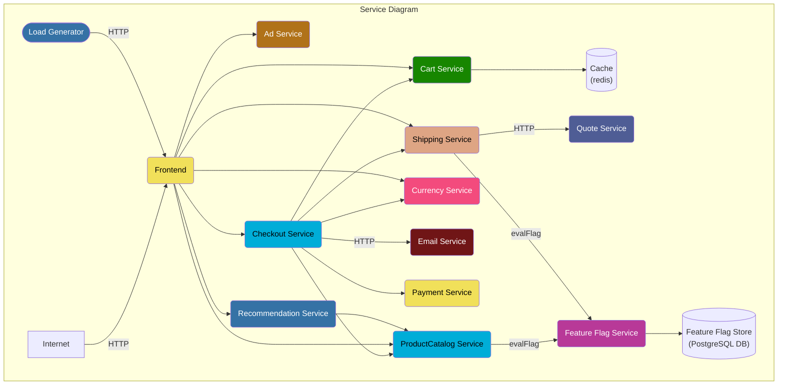
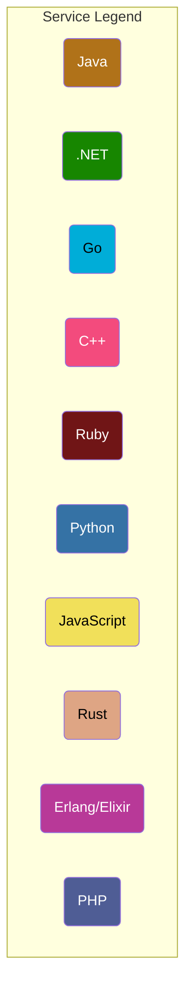

# Dynatrace Otel  Demo

This repository will explain how to deploy the CNCF otel-demo and with OnaAgent and without OneAgent .


## Architecture

**Online Boutique** is composed of microservices written in different programming
languages that talk to each other over gRPC and HTTP; and a load generator which
uses [Locust](https://locust.io/) to fake user traffic.






## Prerequisite
The following tools need to be install on your machine :

- jq
- kubectl
- git
- helm
- Dynatrace Tenant
- gcloud ( if you are using GKE)

## Getting started 
### Dynatrace Tenant
#### 1. Dynatrace Tenant - start a trial
If you don't have any Dyntrace tenant , then i suggest to create a trial using the following link : [Dynatrace Trial](https://bit.ly/3KxWDvY)
Once you have your Tenant save the Dynatrace (including https) tenant URL in the variable `DT_TENANT_URL` (for example : https://dedededfrf.live.dynatrace.com)
```
DT_TENANT_URL=<YOUR TENANT URL>
```


#### 2. Create the Dynatrace API Tokens
The dynatrace operator will require to have several tokens:
* Token to deploy and configure the various components
* Token to ingest metrics and Traces

##### Token to deploy
Create a Dynatrace token ( left menu Access TOken/Create a new token), this token requires to have the following scope:
* Create ActiveGate tokens
* Read entities
* Read Settings
* Write Settings
* Access problem and event feed, metrics and topology
* Read configuration
* Write configuration
* Paas integration - installer downloader
<p align="center"></p>

Save the value of the token . We will use it later to store in a k8S secret
```
DYNATRACE_API_TOKEN=<YOUR TOKEN VALUE>
```
##### Token to ingest data
Create a Dynatrace token with the following scope:
* ingest metrics
* ingest events  
* ingest OpenTelemetry traces
* ingest Logs
* Data ingest, e.g.: metrics and events
<p align="center"></p>
Save the value of the token . We will use it later to store in a k8S secret

```
DATA_INGEST_TOKEN=<YOUR TOKEN VALUE>
```

### Create a Kubernetes Cluster

## Deployment Steps in GCP

You will first need a Kubernetes cluster with 2 Nodes.
You can either deploy on Minikube or K3s or follow the instructions to create GKE cluster:
### 1.Create a Google Cloud Platform Project
```
PROJECT_ID="<your-project-id>"
gcloud services enable container.googleapis.com --project ${PROJECT_ID}
gcloud services enable monitoring.googleapis.com \
    cloudtrace.googleapis.com \
    clouddebugger.googleapis.com \
    cloudprofiler.googleapis.com \
    --project ${PROJECT_ID}
```
### 2.Create a GKE cluster
```
ZONE=europe-west3-a
NAME=<Your ClusterName>
gcloud container clusters create "${NAME}" \
 --zone ${ZONE} --machine-type=e2-standard-2 --num-nodes=4
```

## Clone the Github Repository
```
git clone https://github.com/henrikrexed/kubecon-otel-demo
cd kubecon-otel-demo
```

## Deploy 
The application will deploy the otel demo v0.4.0-alpha
```
chmod 777 deployment.sh
./deployment.sh  --dttoken $DATA_INGEST_TOKEN --dturl $DT_TENANT_URL --paastoken $DYNATRACE_API_TOKEN --clustername ${NAME}
```
if you want to deploy a newer version of the otel-demo you will need to add the --oteldemo_version parameter:
for example: 
```
./deployment.sh  --dttoken $DATA_INGEST_TOKEN --dturl $DT_TENANT_URL --paastoken $DYNATRACE_API_TOKEN --clustername ${NAME} --oteldemo_version v0.4.0-alpha
```


